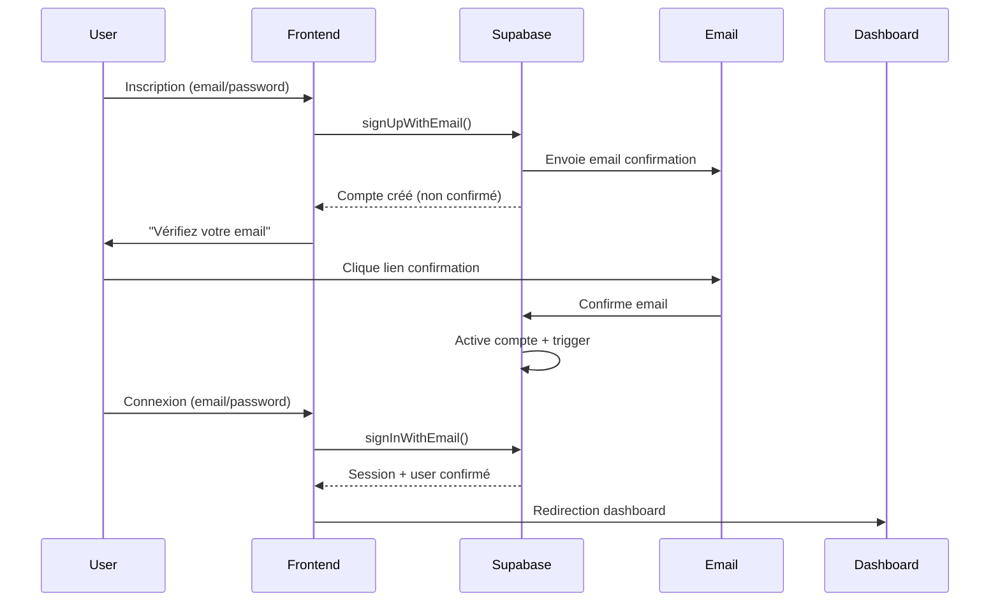

# 🚀 Guide d'Authentification Production

## 📋 **Vue d'ensemble**

Ce guide documente le système d'authentification refactorisé pour la production, supprimant tous les bypass de démo et implémentant une vraie validation email avec un workflow robuste.

## 🎯 **Workflow d'Authentification**



## 🛠️ **Fichiers Modifiés**

### **1. `/src/integrations/supabase/client.ts`**
- ✅ **Supprimé** : `signInWithEmailConfirmationBypass`, `signUpWithoutEmailConfirmation`
- ✅ **Ajouté** : `signUpWithEmail`, `signInWithEmail`, `validateSession`
- ✅ **Ajouté** : `resetPassword`, `resendConfirmation`, `checkUserPermissions`
- ✅ **Sécurisé** : Messages d'erreur conviviaux avec `getFriendlyAuthError()`

### **2. `/src/components/Auth/LoginForm.tsx`**
- ✅ **Gestion d'erreurs UX-friendly** avec messages spécifiques
- ✅ **Bouton "Renvoyer confirmation"** si email non confirmé
- ✅ **Redirection intelligente** avec paramètre `?redirect=`
- ✅ **États de chargement** et feedback utilisateur

### **3. `/src/components/AuthGuard.tsx`**
- ✅ **3 états** : `AUTHENTICATED` / `ORG_REQUIRED` / `UNAUTHENTICATED`
- ✅ **Validation session + RLS** avec `validateSession()`
- ✅ **Gestion organisations** avec permissions granulaires
- ✅ **Redirection automatique** selon l'état d'auth

### **4. `/src/components/SuperAdminSetupModal.tsx`**
- ✅ **Vraie validation email** avec étape de confirmation
- ✅ **Workflow en 2 étapes** : Création → Email → Confirmation
- ✅ **Activation automatique** après confirmation email

### **5. `/src/pages/AuthConfirm.tsx`** *(Nouveau)*
- ✅ **Page de confirmation email** avec gestion des tokens
- ✅ **États** : Loading / Success / Error / Expired
- ✅ **Redirection automatique** après succès

## 📊 **Base de Données**

### **Script de Production : `production_auth_setup.sql`**

#### **Sécurité RLS :**
- ✅ **Suppression** des politiques permissives de démo
- ✅ **Politiques strictes** basées sur `email_confirmed_at`
- ✅ **Révocation** des permissions `anon` excessives

#### **Triggers & Fonctions :**
- ✅ **`activate_super_admin_on_confirmation()`** : Active le super admin après confirmation email
- ✅ **`validate_org_access()`** : Valide l'accès aux organisations
- ✅ **`log_auth_event()`** : Audit des événements d'authentification

#### **Table d'Audit :**
```sql
CREATE TABLE public.audit_log (
  id UUID PRIMARY KEY,
  user_id UUID REFERENCES auth.users(id),
  event_type TEXT NOT NULL,
  event_data JSONB,
  ip_address INET,
  user_agent TEXT,
  created_at TIMESTAMP WITH TIME ZONE DEFAULT NOW()
);
```

## 🔧 **Configuration Supabase**

### **Dashboard Settings :**
1. **Authentication > Settings**
2. ✅ **Activer** "Enable email confirmations"
3. ✅ **Configurer** les templates d'email
4. ✅ **URL de redirection** : `https://votre-app.com/auth/confirm`

### **Variables d'Environnement :**
```env
VITE_PUBLIC_SUPABASE_URL=https://votre-projet.supabase.co
VITE_PUBLIC_SUPABASE_ANON_KEY=votre_clé_anon
VITE_DEBUG=false  # Production
```

## 🎨 **Fonctionnalités UX**

### **Messages d'Erreur Conviviaux :**
- ❌ `"Invalid login credentials"` → ✅ `"Email ou mot de passe incorrect"`
- ❌ `"Email not confirmed"` → ✅ `"Veuillez confirmer votre email avant de vous connecter"`
- ❌ `"User already registered"` → ✅ `"Un compte existe déjà avec cet email"`

### **États de Chargement :**
- 🔄 Spinners pendant les requêtes
- 🚫 Désactivation des champs pendant le traitement
- 📱 Feedback visuel avec toasts

### **Redirection Intelligente :**
- 🔗 URL de retour avec `?redirect=/page-voulue`
- 🏠 Redirection par défaut vers `/dashboard`
- 🔄 Sauvegarde de l'état de navigation

## 🧪 **Circuit de Test**

### **1. Inscription Nouvelle :**
```bash
# 1. Aller sur /auth
# 2. Créer un compte → Email envoyé
# 3. Cliquer lien email → Redirection /auth/confirm
# 4. Confirmation réussie → Redirection /auth
# 5. Se connecter → Accès dashboard
```

### **2. Super Admin Setup :**
```bash
# 1. Premier démarrage → Modal SuperAdminSetup
# 2. Remplir formulaire → Email envoyé
# 3. Confirmer email → Super admin activé
# 4. Se connecter → Accès complet
```

### **3. Gestion d'Erreurs :**
```bash
# 1. Email non confirmé → Bouton "Renvoyer"
# 2. Lien expiré → Demander nouveau lien
# 3. Credentials incorrects → Message clair
```

## 🔒 **Sécurité**

### **Validation Email Obligatoire :**
- 🚫 Aucun bypass possible
- ✅ Vérification `email_confirmed_at` côté serveur
- 🔐 RLS basé sur la confirmation email

### **Permissions Granulaires :**
- 👤 **Utilisateurs** : Accès à leurs données uniquement
- 🏢 **Organisations** : Accès basé sur `user_organizations`
- 👑 **Super Admins** : Accès complet après activation

### **Audit Trail :**
- 📝 Logging des connexions/déconnexions
- 🕵️ Traçabilité des actions administratives
- 🚨 Détection des tentatives d'accès non autorisées

## 🚀 **Déploiement**

### **Étapes de Migration :**

1. **Exécuter le script SQL :**
   ```sql
   -- Dans Supabase SQL Editor
   -- Copier/coller production_auth_setup.sql
   ```

2. **Configurer les emails :**
   - Templates de confirmation
   - URLs de redirection
   - Branding de l'entreprise

3. **Tester le workflow complet :**
   - Inscription → Confirmation → Connexion
   - Gestion d'erreurs
   - Redirection après auth

4. **Monitoring :**
   - Vérifier les logs d'audit
   - Surveiller les erreurs d'auth
   - Analyser les métriques de conversion

## 📞 **Support & Dépannage**

### **Problèmes Courants :**

**Q: Email de confirmation non reçu**
- Vérifier les spams
- Renvoyer via le bouton "Renvoyer"
- Vérifier la configuration SMTP Supabase

**Q: Lien de confirmation expiré**
- Utiliser "Demander un nouveau lien"
- Vérifier la durée de validité dans Supabase

**Q: Erreur RLS après migration**
- Vérifier que `production_auth_setup.sql` a été exécuté
- Contrôler les politiques RLS dans le dashboard

### **Logs de Debug :**
```typescript
// Activer les logs en développement
localStorage.setItem('VITE_DEBUG', 'true');

// Vérifier l'état d'auth
console.log(await validateSession());
```

## ✅ **Checklist de Validation**

- [ ] **Script SQL exécuté** sans erreurs
- [ ] **Email confirmation activée** dans Supabase
- [ ] **Templates email configurés** avec bonnes URLs
- [ ] **Inscription + confirmation** fonctionne
- [ ] **Connexion normale** fonctionne
- [ ] **Super admin setup** fonctionne
- [ ] **Gestion d'erreurs** UX-friendly
- [ ] **Redirection intelligente** opérationnelle
- [ ] **RLS policies** sécurisées
- [ ] **Audit logs** fonctionnels

---

**🎉 Système d'authentification production prêt !**

*Version: 2.0 - Production Ready*  
*Dernière mise à jour: $(date)*